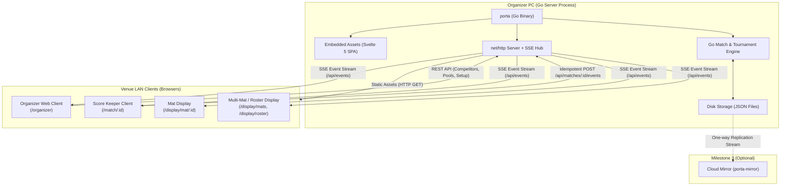
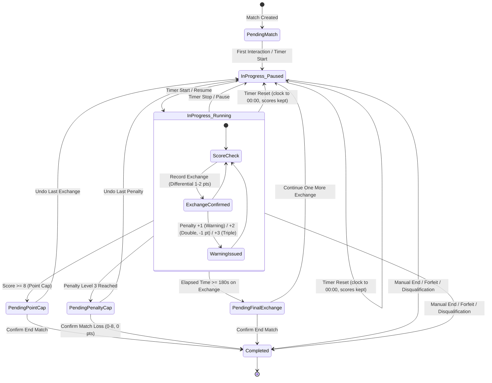
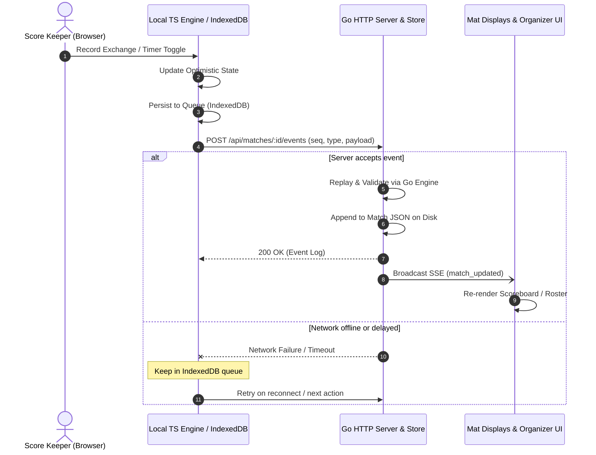
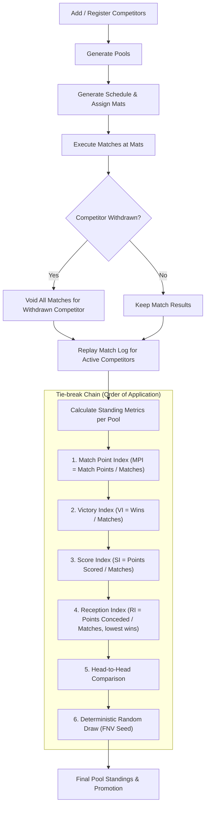
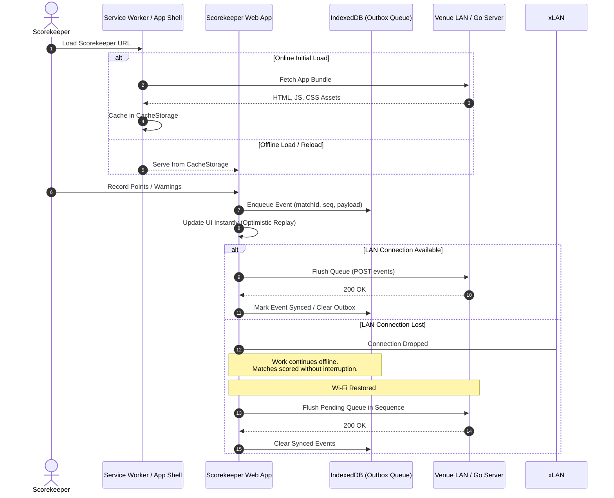

# Architecture & System Design Visualizations

This document provides architectural diagrams for Porta di Ferro, illustrating component boundaries, state lifecycles, event synchronization, tournament ranking pipelines, and offline-first capabilities.

---

## 1. System & Deployment Architecture

Porta di Ferro runs as a single Go binary on the organizer's PC, embedding the Svelte 5 SPA via `//go:embed`. Devices connect locally across the venue LAN without requiring an external internet connection.

---

## 2. Match Engine State Machine & Scoring Logic

Matches are driven by an append-only event log. State is pure and recomputed by replaying events. Points are differential (e.g., scoring $2$ vs $1$ awards $1$ net point to the higher scorer), capped at $8$ points or $3$ minutes ($180\,000\text{ ms}$).

---

## 3. Data Flow, Sync & Event Logging

The score keeper client applies updates optimistically to its local TypeScript engine while queueing the event to IndexedDB. The event is posted with `(match_id, sequence)` for server validation, JSON disk persistence, and SSE broadcast.

---

## 4. Tournament Lifecycle & Ranking Pipeline

Tournaments progress through competitor intake, pool generation, schedule assignment across mats, match execution, and multi-tier index ranking.

---

## 5. Offline & Local-First Resilience

Scorekeeper devices stay operational even during transient venue Wi-Fi dropouts by leveraging a Service Worker app shell and IndexedDB event spooling.

