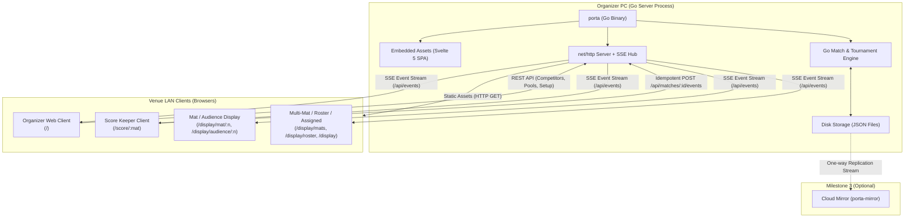
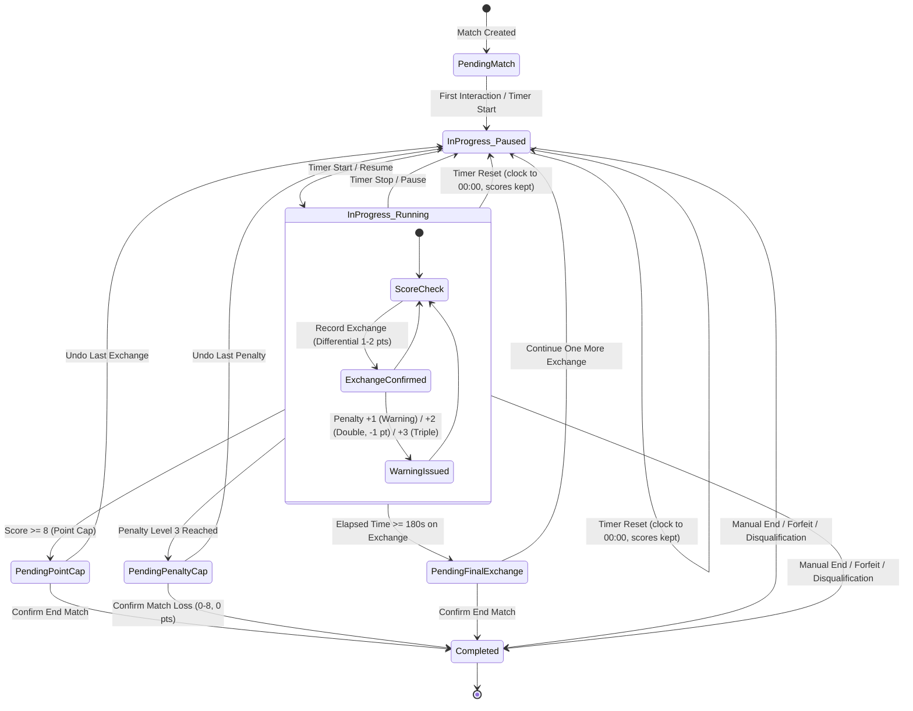
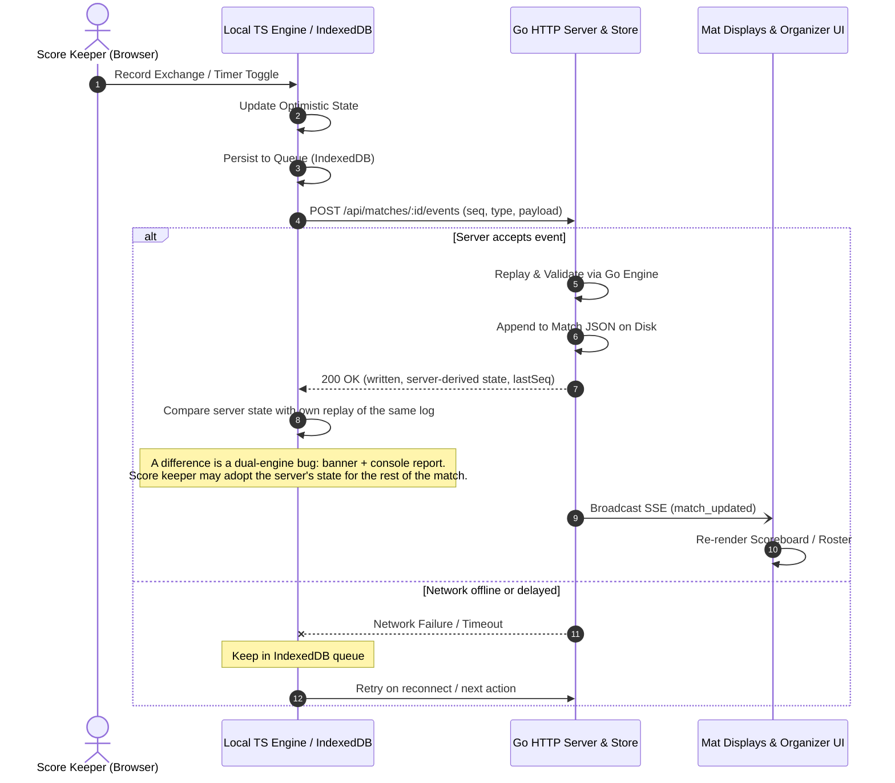
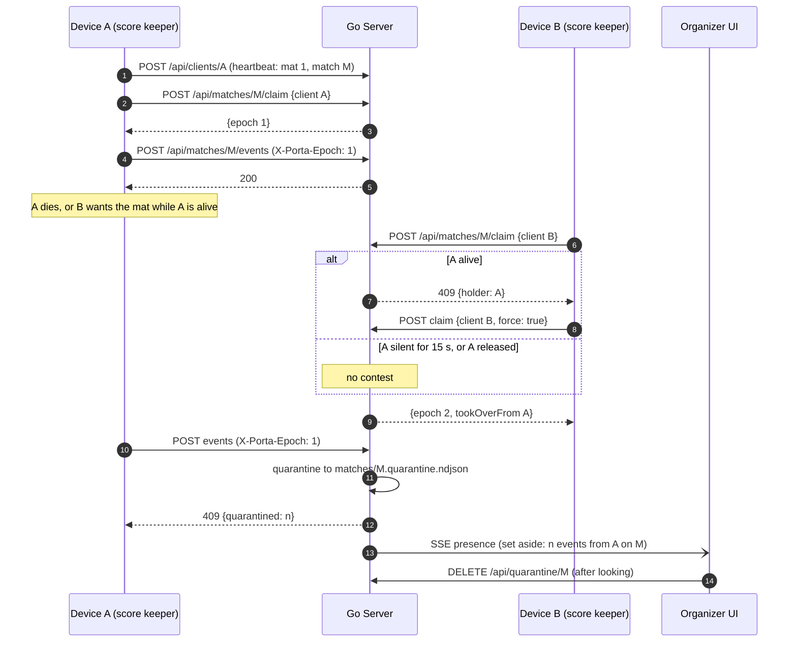
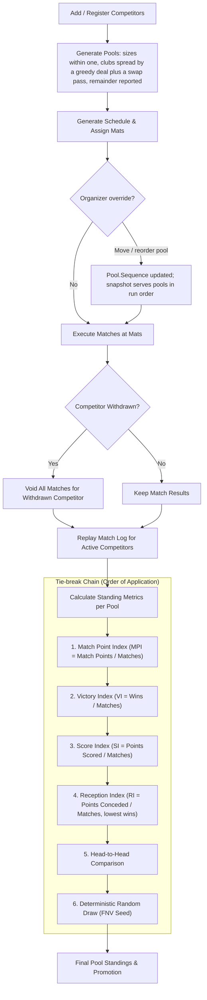
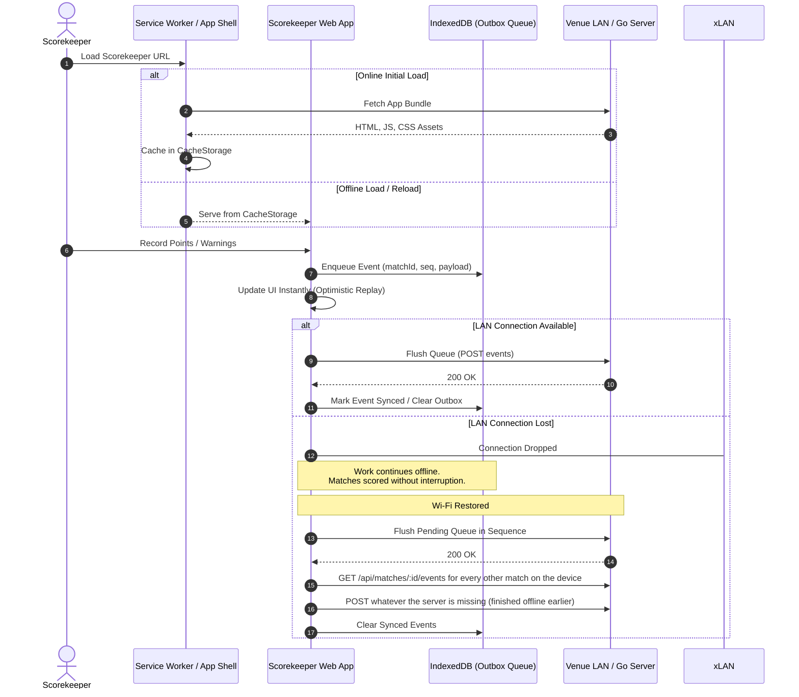

# Architecture & System Design Visualizations

This document provides architectural diagrams for Porta di Ferro, illustrating component boundaries, state lifecycles, event synchronization, tournament ranking pipelines, and offline-first capabilities.

---

## 1. System & Deployment Architecture

Porta di Ferro runs as a single Go binary on the organizer's PC, embedding the Svelte 5 SPA via `//go:embed`. Devices connect locally across the venue LAN without requiring an external internet connection.

---

## 2. Match Engine State Machine & Scoring Logic

Matches are driven by an append-only event log. State is pure and recomputed by replaying events. Event types are `exchange`, `timer` (start / stop / resume / reset), `undo`, `end`, and `options` — the last carries the competitors' colours and the display side order, is ignored by replay, and is read separately by `OptionsOf` / `optionsOf` so presentation can never fail a scoring vector. Points are differential (e.g., scoring $2$ vs $1$ awards $1$ net point to the higher scorer), capped at $8$ points or $3$ minutes ($180\,000\text{ ms}$).

---

## 3. Data Flow, Sync & Event Logging

The score keeper client applies updates optimistically to its local TypeScript engine while queueing the event to IndexedDB. The event is posted with `(match_id, sequence)` for server validation, JSON disk persistence, and SSE broadcast.

---

## 3b. Connected Clients, Handover and Server-Assigned Displays

Every score keeper client and every `/display` screen announces itself with a stable id and heartbeats every five seconds (`POST /api/clients/{id}`); the registry lives in memory and is pushed to the organizer over SSE as `presence`. A score keeper claims its match before writing (`POST /api/matches/{id}/claim`) and stamps every push with the granted epoch; the claims live in `writers.json` so they survive a restart. The mat's own idea of which match is up follows the live score keeper on it, so displays show a finished match's result for exactly as long as the score keeper holds it.

Displays: a screen opens `/display`, heartbeats with role `display`, and renders whatever `target` comes back (`mat/1`, `audience/2`, `mats`, `mats/1,2`, `roster`). The organizer sets it with `PUT /api/clients/{id}/target`; assignments are kept in `displays.json`.

---

## 4. Tournament Lifecycle & Ranking Pipeline

Tournaments progress through competitor intake, pool generation, schedule assignment across mats, match execution, and multi-tier index ranking.

---

## 5. Offline & Local-First Resilience

Scorekeeper devices stay operational even during transient venue Wi-Fi dropouts by leveraging a Service Worker app shell and IndexedDB event spooling. The last snapshot is kept in `localStorage` too, so a client opens with the pool's schedule and names when the server is unreachable; the score keeper client keeps its own record of which matches it has finished, so it can move through a whole pool offline. On reconnect, every match log on the device that the server is missing is pushed — not only the match on screen.

