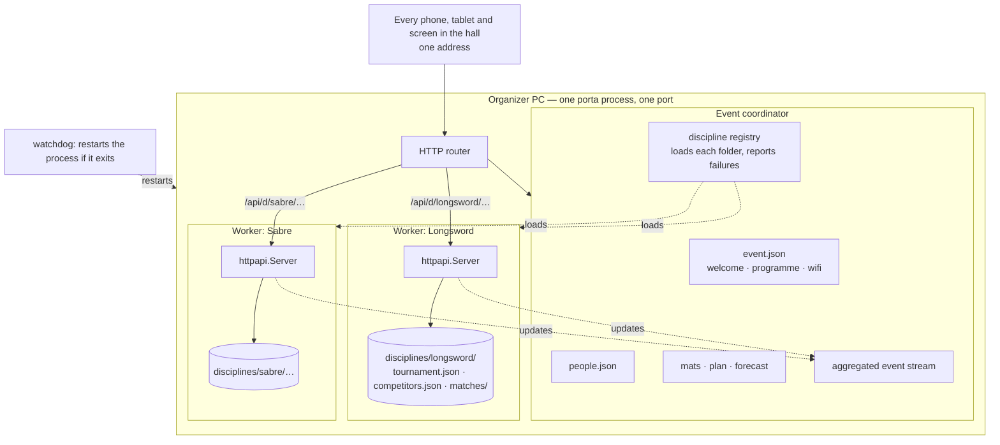
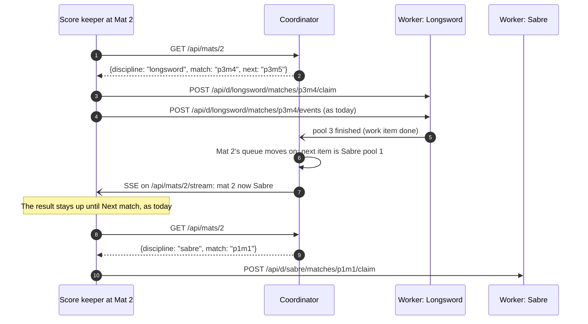
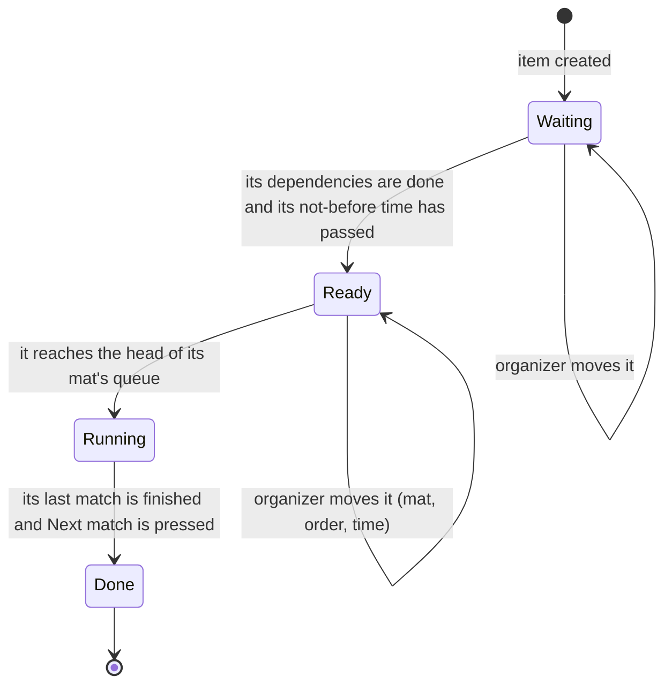

# Design Proposal: One Event, Many Disciplines

> **Status: accepted; phases 1–4 built.** The maintainers took every recommendation (§15).
> Phase 1 — one event, one address — phase 2 — physical mats, work items and the mat board —
> phase 3 — people, one signup for the event, `/who/{person}` — and phase 4 — the forecast,
> suggestions with pins, planning before the draw — are built: see
> [docs/architecture.md](../architecture.md) §1a for what they became. Mat availability and
> named mats from §6's API table are not built; programme breaks stop every mat. The bronze match and the
> final are items of their own by default (§15, 4). The event's signup lives at
> `/api/event/signup/…`, so a one-discipline event's `/api/signup/…` still answers as its
> discipline. Phase 5 is not. It answers issue #102 and the comments on it, and deliberately goes past the issue's original scope: the comments asked for
> mats to be treated as a shared resource and for a planning view across disciplines, and both
> change the architecture enough that they have to be designed together with the landing page,
> not after it. Related issues: #4 (add a discipline), #5 (staff), #6 (timetable), #64 (event
> planning mode), #101 (drag a pool between mats), #104 (a way into `/admin`).

## Contents

1. [Summary](#1-summary)
2. [The problem](#2-the-problem)
3. [Goals, non-goals and requirements](#3-goals-non-goals-and-requirements)
4. [Vocabulary](#4-vocabulary)
5. [Decision 1 — Process topology](#5-decision-1--process-topology)
6. [Decision 2 — Addresses and HTTP endpoints](#6-decision-2--addresses-and-http-endpoints)
7. [Decision 3 — Where state lives](#7-decision-3--where-state-lives)
8. [Decision 4 — Identity across disciplines](#8-decision-4--identity-across-disciplines)
9. [Decision 5 — Mats as a shared resource](#9-decision-5--mats-as-a-shared-resource)
10. [Decision 6 — The plan, the forecast and the mat board](#10-decision-6--the-plan-the-forecast-and-the-mat-board)
11. [When something breaks](#11-when-something-breaks)
12. [Consequences for the clients](#12-consequences-for-the-clients)
13. [What happens to what exists](#13-what-happens-to-what-exists)
14. [Delivery in phases](#14-delivery-in-phases)
15. [Decisions needed from the maintainers](#15-decisions-needed-from-the-maintainers)

---

## 1. Summary

An event becomes a first-class thing, sitting above the disciplines rather than being copied into
each of them. Concretely:

- **An event coordinator** owns everything that is about the event rather than about one
  discipline: the welcome, the programme, the wifi, the people, the physical mats and the plan of
  what runs where and when. It serves **one address** for the whole hall.
- **Each discipline stays isolated on disk**, exactly as #49 made it: its own data folder, its
  own `tournament.json`, `competitors.json` and match logs, its own ruleset and its own lock.
- **Recommended: one process serves every discipline**, rather than one executable per discipline
  on its own port, and rather than a process or actor per discipline inside it. Disciplines
  happening at the same time in the hall does not need them running in parallel in the server, and
  process boundaries protect against almost none of the failures this product actually has (§5).
  The split that matters is by *data* (a folder per discipline) and by *responsibility* (event code
  apart from discipline code). The code already supports it: `httpapi.Server` has no global state,
  so several can run side by side. A small watchdog that restarts the whole process gives
  "let it crash" where it is worth having.
- **Mats belong to the event.** A score keeper or a display is bound to a *physical* mat and
  follows whatever that mat is running, across disciplines. What a mat runs comes from an
  event-wide queue of *work items* — a pool, a bracket round, the finals — placed by the plan.
- **Stages report back.** When a discipline's pools are done, it tells the coordinator; its mats
  move on to whatever the plan has next for them; its eliminations become work items that the plan
  places. That is the "results reported to the parent, mats returned to the pool" model from the
  comments, without needing a new process per stage.
- **The plan is suggested, then owned by the organizer.** The app proposes a schedule from pool
  sizes, measured match times and the event's timetable; the organizer drags work items between
  mats and times on a mat board; a live forecast says how the day is actually going.
- **People are one record across the event**, so `/who/:person` shows somebody's whole day and the
  planner can see that the Astrid in Longsword is the Astrid in Sabre.

It is delivered in five phases (§14). The first already fixes what #102 asked for — one landing
page — and every later phase is useful on its own.

---

## 2. The problem

### What a hall sees today

Several disciplines at once are several runs of the application (#49). Each is its own process,
on its own port, with its own data folder. The first run can start the others and knows their
addresses; nothing below that line knows the others exist.

That was the right call for the problem it solved — one run is one tournament under one ruleset,
and nothing inside it had to change — and it is exactly what now gets in the way:

| Symptom | Why |
|---|---|
| A spectator sees whichever discipline's address they scanned | Each discipline is its own origin (`http://host:8080`, `http://host:8081`); the server sends no CORS headers, so a page from one cannot read another |
| The organizer types the programme, the welcome and the wifi into every discipline | `Tournament.Event` (#98) is stored per run |
| Somebody fencing two disciplines is two unrelated records | Competitor ids are per run (`c1`, `c2` …) and collide by construction |
| `/who/c7` shows half of a person's day | It only knows one run |
| "Mat 1" means a different mat in each discipline | Mats are numbered per run, so mat 1 of Sabre and mat 1 of Longsword are both "mat 1" |
| #98 asked for the roster "divided up per discipline" | There is nothing to divide: each page holds one discipline |

### What the comments add

The comments on #102 widen the problem, rightly:

- **Mats are a resource the disciplines share.** A discipline should be *given* mats for a stage,
  run on them, and give them back. Pools finish, mats are freed, eliminations need mats, the finals
  may want one particular mat at the end of the day.
- **A day has sync points.** Finals are often held back to the end of the day; a big field breaks
  for lunch in the middle of the pools. Those are planning facts, not accidents.
- **The organizer needs a view across disciplines** to place pools, brackets and finals on mats
  and in time, with a suggestion from the app and easy changes on the fly — because pools do not
  take the time the plan said they would.

### Why this is architecture first

None of those can be solved inside one run, because each one is a fact about the *event*: which
mats exist, who is in more than one discipline, what is on mat 3 at half past ten. Today there is
no place for an event-wide fact to live. Making that place is the decision; the landing page,
the mat board and personal schedules are what it enables.

---

## 3. Goals, non-goals and requirements

### Goals

- One address for the whole hall: the landing page, the info sheet, the displays and the score
  keepers.
- Event-wide facts stored once: welcome, programme, wifi, signup, people, mats.
- Mats managed as one pool of resources across disciplines and stages.
- A plan that the app can suggest and the organizer can change at any moment, with a forecast of
  how the day is really going.
- A person's whole day in one place.

### Non-goals

- Changing how one discipline runs a pool or a bracket. The tournament engine, the match engine,
  the ranking chain and the match logs are unaffected.
- Data-driven rulesets (#2, design §8 item 12). Each discipline keeps its ruleset; this proposal
  only has to make room for them differing.
- Anything internet-facing. Everything here is on the venue LAN, as now.
- Optimal scheduling. The suggestion has to be good and explainable, not provably best (§10).

### Requirements

Every option below is judged against these.

| # | Requirement |
|---|---|
| R1 | **One address** for every screen in the hall, so one QR code on the poster is enough |
| R2 | **A broken discipline degrades, never breaks** the pages everyone is looking at |
| R3 | **Event-wide state is stored once** |
| R4 | **One identity per person** across disciplines |
| R5 | **Mats are event-wide**, and a device at a mat follows that mat across disciplines |
| R6 | **A plan the organizer can change on the fly**, suggested by the app |
| R7 | **Disciplines stay isolated**: own folder, own files, own ruleset, hand-editable, as #49 made them |
| R8 | **Score keepers stay offline-first**: a dropped LAN never stops a match being scored |
| R9 | **Still one executable** and a five-minute install (design §1) |
| R10 | **A one-discipline event stays as simple as it is today** |
| R11 | **The public demo keeps working** and can show the new parts |

---

## 4. Vocabulary

Used precisely from here on.

| Term | Meaning |
|---|---|
| **Event** | The day (or weekend) at one venue. Has a welcome, a programme, a wifi network, people, mats and a plan |
| **Discipline** | One tournament under one ruleset: "Open steel Longsword". Today's run of the application. Later it may be weapon × category (design §8 item 9) |
| **Stage** | A phase of a discipline: *pools*, *eliminations*, *finals*. A stage cannot start before the one it depends on is done |
| **Work item** | The unit of mat time the plan places: one pool, one bracket round (or part of one), the finals. Has an estimated duration |
| **Mat** | A physical piece of floor with a number the hall can see: "Mat 3". Event-wide |
| **Mat queue** | The ordered list of work items a mat will run. Its head is what the mat is doing now |
| **Plan** | Every work item's mat and order, plus time constraints. What the organizer edits |
| **Forecast** | The plan re-timed against what has actually happened. Read-only; recomputed all day |
| **Person** | One human across the event. A competitor record in a discipline, and a staff entry, point at a person |
| **Coordinator** | The event-level code that owns all of the above and loads the disciplines |
| **Worker** | One discipline as the coordinator holds it: a tournament with its own folder and lock. Not a separate process, thread or actor |

---

## 5. Decision 1 — Process topology

The question the issue opened with: how do the disciplines and the event-wide part relate as
running programs? Everything else depends on the answer.

### First, is "a process per discipline" the right question?

The comments propose a parent process per tournament and a process per discipline, with mats
handed out and results reported up, and come at it from Erlang. Part of that is exactly right and
part of it is worth challenging before it shapes the design.

**What is right: mats are a contested resource, and stages have sync points.** Two disciplines
cannot use one mat at once, the eliminations cannot start before the pools are done, and the
finals may be held for the end of the day. That is a real allocation problem, and §9 and §10 are
built around it.

**What does not follow: that a discipline must be its own thread or process to run
concurrently.** Disciplines happening at the same time *in the hall* does not mean they need to
run in parallel *in the server*:

- Every HTTP request is already handled on its own goroutine. Two score keepers on two
  disciplines are served side by side today, inside one process, with no extra design.
- The work per request is small: replaying a match log and appending one exchange is dominated
  by the disk sync, a few milliseconds at most. A busy hall produces a write every few seconds. A
  single lock over the whole event would hardly ever be contended, and each discipline keeps its
  own lock anyway, as today.
- Parallel execution is a performance tool, and there is no performance problem to solve.

**Isolation from what?** The other argument for a process per discipline is that one failing
cannot take the others down. It is worth listing what actually fails at an event:

| Failure | Contained by a process per discipline? |
|---|---|
| The laptop sleeps, loses power or is closed | no — everything is on it |
| The venue wifi drops | no — and the clients already survive it (R8) |
| A hand-edited file no longer parses | only by loading each discipline separately, which one process can do equally well |
| A bug in the code | rarely: every discipline runs the *same* code, so a bug one can hit, the others usually can too |

Process boundaries mainly help with the last case, and only when a bug is triggered by one
discipline's data and not another's. Against that they cost a protocol between the parts (option
C below), and the costs of a protocol are paid on every feature, not only when something fails.

**The decisions that matter most need one consistent view.** "One discipline per mat at a time",
"nobody in two places at once" and "no referee who is fencing" are decisions across several
disciplines' state at once. With isolated units that only exchange messages, each becomes a small
distributed agreement with its own failure modes: a message lost while a worker restarts, two
units disagreeing after a crash. Erlang itself would solve it by sending every such decision through
one coordinating process. That process serialises them, which is a lock by another name. Isolation
is the wrong default for state that has to agree across disciplines.

**Where Erlang's model earns its keep, and why that is not here.** It shines with many
independent, long-lived units that fail often, run across machines and are upgraded while running.
A club event has a handful of disciplines on one laptop, all state on disk, clients that keep
scoring through an outage, and a restart that only has to re-read a few JSON files. In that setting the cheapest
form of "let it crash" is coarse: **restart the whole process** and let it reload from disk. A tiny
watchdog — the executable starting itself as a child and restarting it when it exits — gives that
with no supervision code inside the application.

**So the useful split is by data and responsibility, not by execution unit.** Each discipline
keeps its own folder, files and lock (data isolation, which is what #49 really bought), and the
event's code is kept apart from the discipline's code (responsibility). How many OS processes or
goroutines that runs on is a detail, and the simplest answer — one — is the right one until there
is evidence otherwise.

**When to revisit.** Separate processes, or separate machines, become worth their protocol if
any of these turns up:

- an event that needs disciplines on more than one PC — two halls, or more mats than one laptop
  and one network can serve;
- a need to run different versions of the software for different disciplines;
- evidence from real events of crashes that hit one discipline and not the others.

The first is the most plausible, and it is a different problem, distribution rather than isolation.
If it comes, the coordinator becomes a hub that other PCs report to, and the work in §6–§10 carries
over unchanged.

### The options

**A. The parent proxies** (the issue's option 1). Today's processes stay as they are. The first
instance answers `/api/event` by fetching each sibling over localhost and returning a combined
picture.

- For: smallest change; no new deployment shape.
- Against: only fixes the read side of the landing page. Event-wide state still has nowhere to
  live, mats are still per discipline, and the parent only knows the siblings *it* started. Score
  keepers and displays still need a different address per discipline. A partial answer to R1 and
  none to R3–R6.

**B. CORS and client fan-out** (the issue's option 2). Every discipline sends CORS headers; the
landing page fetches all of them directly.

- For: no aggregator that can fall over; each discipline answers for itself.
- Against: every phone in the hall holds a live stream to every discipline. The list of
  disciplines still has to come from somewhere. Identity, event-wide state and mats are not
  addressed at all, and any cross-discipline logic (who is double-booked) would have to run in
  every browser. Fails R3–R6.

**C. A coordinator with OS-process workers.** The coordinator is the one address. It owns the
event state, mats, people and plan, and **reverse-proxies** discipline traffic to a worker process
per discipline on a localhost port (`/api/d/longsword/…` → `127.0.0.1:9101/api/…`). It starts,
watches and restarts the workers. It aggregates their event streams into the landing page's
stream. This is the comments' model, taken literally.

- For: the strongest crash isolation. A discipline that panics loses only itself, and the
  coordinator restarts it. Workers are today's code nearly unchanged. And it is the shape a
  multi-PC event would need, if that ever becomes a requirement.
- Against:
  - The coordinator and workers talk over HTTP on localhost, so every interaction — "pools are
    done", "this mat is yours next", "who is Astrid" — becomes a little protocol with its own
    failure cases: the worker is restarting, the message was half-delivered, the two disagree
    after a crash.
  - Ports are opened and tracked, the Windows tray has one icon per process today, and the
    coordinator has to subscribe to every worker's event stream and re-publish it.
  - The public demo cannot do any of it: it runs in one browser tab as WebAssembly, with no
    processes and no sockets (R11).
  - The coordinator is still a single point of failure for the hall, because it is the address.
    So the isolation it buys protects against discipline-specific crashes only, not against the
    failure that matters most.
  - The decisions that span disciplines (mats, people, staff) cross a process boundary every
    time, which is the hardest part of the design to get right and test.

**D. One process serving every discipline — recommended.** One OS process, one port. Each
discipline is an `httpapi.Server` exactly as today — its own store and folder, its own SSE hub, its
own write lock, its own presence — mounted under its own path prefix. The coordinator is ordinary
code in the same process, calling the disciplines through Go methods.

- For:
  - It keeps what was right in the comments — mats handed out, stages reporting up — and drops
    the plumbing that option C needs to do the same across processes.
  - Decisions across disciplines are made against one consistent view, under one lock, in one
    place. They can be tested as ordinary functions.
  - It needs little new machinery: `httpapi.Server` keeps all of its state on the struct and none
    in package variables, so several can live in one process — the Go tests already create one
    per test.
  - One address and one browser origin come for free (R1). The aggregated stream is a
    subscription to N in-memory hubs.
  - The demo can run a multi-discipline event, because nothing here needs processes or sockets
    (R11).
- Against:
  - **A crash takes every discipline down at once.** Two cheap measures cover the realistic
    cases:
    - A discipline whose files will not load is reported as failed and skipped, never fatal (§11).
    - A watchdog restarts the process when it dies. HTTP handlers are already recovered per request
      by `net/http`, and the few background goroutines recover, as a coding rule.
    - Clients ride through the restart as they ride through a wifi drop.
  - A runaway discipline (a hot loop, a leak) shares memory and CPU with the others. At this
    scale — four disciplines, a few hundred matches — that is a risk on paper more than in practice.

**E. One tournament with disciplines inside it** (the issue's option 3 as written). Merge the
disciplines into one `tournament.json` and one engine instance. This undoes #49: one ruleset per
run, the hand-editable folder per discipline and the engine's assumption that it owns one
tournament all go. Ruled out, for the reasons the comments give. **Option D is not this.** In D
every discipline keeps its own folder, files, ruleset, lock and engine; only the process, the
address and the event-level code are shared.

### Comparison

| | A proxy | B fan-out | C OS workers | **D one process** | E merge |
|---|---|---|---|---|---|
| R1 one address | reads only | no | yes | **yes** | yes |
| R2 degrade | parent is SPOF | per discipline | coordinator is SPOF | **coordinator is SPOF** | all or nothing |
| R3 event state once | no | no | yes | **yes** | yes |
| R4 one identity | no | no | yes | **yes** | yes |
| R5 event-wide mats | no | no | yes, via protocol | **yes, in memory** | yes |
| R6 plan across disciplines | no | in every browser | yes, via protocol | **yes, in memory** | yes |
| R7 isolation | full | full | full, by OS | **full on disk; a crash restarts everything** | lost |
| R8 offline score keepers | unchanged | unchanged | unchanged | **unchanged** | unchanged |
| R9 one executable | yes | yes | yes, N processes | **yes, one process** | yes |
| R11 demo | no | no | no | **yes** | yes |
| Decisions across disciplines | none possible | in every browser | over a protocol | **one view, one lock** | one view |
| New machinery | small | small | large | **moderate** | very large |

### Recommendation

**D: one process, a folder per discipline, and a watchdog around the process.** No actors,
mailboxes or in-process supervisors. They would add machinery to protect against failures this
product rarely has, and make the decisions it constantly has to make — across disciplines — harder.

The coordinator talks to a discipline through a small interface (`Discipline` below). That is
worth having for its own sake: the coordinator's logic can be tested against fake disciplines,
and the demo can supply in-memory ones. It is **not** there to prepare for separate processes. If
one of the triggers above ever fires, the interface is where a remote implementation would go, but
designing for that now would be paying for a requirement nobody has.

```go
// What the coordinator needs from a discipline. Implemented by today's httpapi.Server
// with a few additions; faked in the coordinator's tests and supplied by the demo.
type Discipline interface {
    Slug() string                       // "longsword", stable, used in URLs and folders
    Handler() http.Handler              // today's routes, mounted under /api/d/{slug}/
    Snapshot() (httpapi.Snapshot, error)
    Subscribe() (<-chan httpapi.Update, func())
    WorkItems() []WorkItem              // what it needs mat time for, with estimates
    Entries() []Entry                   // its competitors, with the person they point at
    Health() Health                     // loaded, or failed to load and why
}
```



---

## 6. Decision 2 — Addresses and HTTP endpoints

The comments ask how this affects the HTTP endpoints. This section explains it from first
principles, because the choice of address shapes far more than it first appears to.

### Why the address matters

Every page in the hall is a URL: the scheme, the host, the **port** and the path. To a browser,
scheme + host + port is the **origin**, and the origin is a wall:

- A page may only read data from its own origin unless the other origin opts in (CORS).
- Everything a page stores on the device — the score keeper's queue of unsent exchanges in
  IndexedDB, the remembered mat, the cached last snapshot — is stored *per origin*.
- The QR code on the poster can only point at one origin.

Today each discipline is a different port, so a different origin. That is why the landing page
cannot show Sabre from Longsword's address, and also — usefully — why two disciplines' score
keepers never trip over each other's stored data. Moving to one address (R1) removes the first
problem and the second protection at the same time. The second has to be put back deliberately
(§12).

### The principle

Under one address, the **path** says what a request is about:

- `/api/event/…`, `/api/mats/…`, `/api/people/…` — the event, answered by the coordinator.
- `/api/d/{discipline}/…` — one discipline, handed to that worker unchanged. Everything a
  discipline answers today keeps its shape; it just gains a prefix.

The router does nothing cleverer than look at the first path segments and hand the request on —
in option D, to the right `httpapi.Server` in memory through `http.StripPrefix`.

### Pages

| Page | Who it is for | What it shows | Today |
|---|---|---|---|
| `/` | everyone in the hall | welcome, one programme, every discipline's competitors and results, what is on every mat | one discipline |
| `/who/{person}` | one competitor or their friends | that person's whole day: every discipline, every match, estimated times | one discipline's half |
| `/info` | the wall by the door | one poster for the event | per discipline |
| `/admin` | the organizer | the event: disciplines, mats, the mat board, people, signup, welcome, wifi | per discipline |
| `/admin/{discipline}` | the organizer | one discipline's competitors, pools, bracket, match editor — today's `/admin` | — |
| `/score`, `/score/{mat}` | score keepers | pick a physical mat; then whatever that mat is running, in any discipline | per discipline |
| `/display/mat/{mat}`, `/display/audience/{mat}` | screens | one physical mat, following it across disciplines | per discipline |
| `/display/mats`, `/display/roster` | screens | every mat, or the coming matches, labelled by discipline | per discipline |
| `/display` | screens | whatever the organizer assigns | per discipline |

### API

Grouped by who answers. New in bold; everything else exists today and only moves under a prefix.

| Route | Answered by | Purpose |
|---|---|---|
| **`GET /api/event`** | coordinator | the event: disciplines and their health, mats, programme, welcome, wifi |
| **`PUT /api/event/info`** | coordinator | welcome, non-fencing programme items, wifi — today's `PUT /api/event`, once |
| **`GET /api/event/stream`** | coordinator | SSE for event pages: event changes plus a summary update from every discipline |
| **`POST /api/disciplines`**, **`PATCH`/`DELETE /api/disciplines/{d}`** | coordinator | add, rename, retire a discipline (#4); replaces `/api/instances` |
| **`GET`/`PUT /api/mats`** | coordinator | the physical mats: how many, their names, when each is unavailable |
| **`GET /api/mats/{mat}`** | coordinator | what this mat is running now and next: discipline, match id |
| **`GET /api/mats/{mat}/stream`** | coordinator | SSE that follows one mat across disciplines, for score keepers and displays |
| **`GET /api/plan`**, **`PATCH /api/plan/items/{item}`** | coordinator | the plan; move a work item to a mat, an order or a time; pin it |
| **`POST /api/plan/suggest`** | coordinator | a suggested plan — **writes nothing**, like the signup preview |
| **`POST /api/plan/apply`** | coordinator | take a suggestion, re-checked on the server as the signup import is |
| **`GET /api/forecast`** | coordinator | the plan re-timed against reality |
| **`GET /api/people`**, **`GET /api/people/{person}`** | coordinator | people; one person's day, gathered from every discipline |
| **`POST /api/people/{person}/link`** | coordinator | say that a competitor record in a discipline is this person (§8) |
| `/api/signup/…` | coordinator | moves up: one definition for the event, one import that gives every discipline its share |
| `POST /api/clients/{id}` | coordinator | heartbeats move up: a device belongs to a mat, not a discipline |
| `GET /api/d/{d}/state`, `GET /api/d/{d}/events` | worker | today's snapshot and SSE stream |
| `/api/d/{d}/competitors…`, `/api/d/{d}/tournament…` | worker | today's competitor and pool endpoints |
| `/api/d/{d}/matches/{id}/events`, `…/claim` | worker | scoring, claims and the log editor, unchanged |
| `/api/d/{d}/export.json`, `/api/d/{d}/export.pdf` | worker | today's exports, per discipline |
| **`GET /api/export.pdf`** | coordinator | the whole event in one document |

### How a score keeper finds its match

The one flow that changes most, so here it is in full. The device is bound to a physical mat;
which discipline it scores for is looked up, not chosen.



Two rules keep this safe:

- **A mat never changes discipline in the middle of a match.** The queue moves on only when the
  work item's last match is finished *and* the score keeper has pressed *Next match*, which is the
  moment the device already lets go of a match today.
- **Offline is unchanged.** A device that loses the LAN keeps scoring the match it has, and the
  unsent exchanges carry their full path, `/api/d/longsword/matches/p3m4/events`, so they land in
  the right discipline whenever the network comes back — even if the mat has moved on.

### Compatibility

While an event has exactly one discipline, today's unprefixed routes (`/api/state`,
`/api/matches/…`) answer as aliases of `/api/d/{only}/…`. A one-discipline event then looks
exactly as it does now (R10), and old bookmarks keep working. The aliases are removed once the
clients no longer use them.

---

## 7. Decision 3 — Where state lives

### The split

| State | Lives in | Why there |
|---|---|---|
| Welcome, wifi | event | one hall, one network |
| Programme items that are not fencing (gear check, lunch, prize giving) | event | one day |
| Fencing items of the programme | **derived** from the plan and forecast | so they cannot disagree with what the mats are actually doing |
| Mats, mat availability | event | physical |
| Plan: work items' mats, order, pins, not-before times | event | crosses disciplines |
| People | event | crosses disciplines |
| Signup definition and import | event | one file out, one folder back; each discipline still gets its own entries |
| Staff and their assignments | event | one person cannot referee two mats at once (#5) |
| Display assignments, device presence | event | devices belong to mats |
| Discipline name, ruleset, pool constraints | discipline | as today |
| Competitors (entries), each pointing at a person | discipline | as today, plus the pointer |
| Pools, bracket, seed, violations | discipline | as today |
| Match logs, claims | discipline | as today; untouched |

### On disk

The organizer still owns a folder of plain JSON they can open in a text editor (design decision
8). It gains a level:

```text
Porta di Ferro/
  MSL Open 2026/                 one event
    event.json                   welcome, programme items, wifi, mats, plan
    people.json                  people
    staff.json                   staff and assignments
    displays.json                screen assignments
    disciplines/
      longsword/                 exactly today's tournament folder
        tournament.json
        competitors.json
        writers.json
        matches/p1m1.ndjson …
      sabre/
        …
```

**Migration** is a move, not a conversion: an existing tournament folder becomes
`disciplines/<slug>/` of a new event, and its `Tournament.Event` is lifted into `event.json` the
first time. A folder from before this change opens as a one-discipline event with no other
difference (R10).

---

## 8. Decision 4 — Identity across disciplines

"Everyone entered", a personal day and a planner that sees double-booking all need to know that
two competitor records are one person. Competitor ids cannot do it: they are per discipline and
sequential, so `c7` exists in every discipline and means somebody different in each.

### Options

**a. Match on name and club.** Automatic and needs nothing new. Wrong in exactly the cases that
matter: two Anna Nilssons from the same club is a real thing (the reason #91 added submission ids),
and "Karl-Johan" and "Karl Johan" are one person. A silent wrong merge puts a stranger's matches on
somebody's page.

**b. The signup submission id.** #91 already gives each participant a stable id, and one response
can enter several disciplines. Exact, and free for everyone who signed up through the file. Leaves
out everyone typed in by hand at the desk.

**c. An event-level person registry, with explicit links — recommended.** `people.json` holds one
record per person with a random id (`pr-4f9a…`, never sequential, so ids never collide between
events or devices). A competitor record gains a `person` field.

- **Signup import** creates or reuses the person by submission id (b) and links every entry it
  creates. Exact, no questions asked.
- **Typing a name at the desk** offers the existing people with that name as a suggestion. The
  organizer picks one or confirms a new person. Never merged silently.
- **The people page** in `/admin` lists likely duplicates (same normalised name) for the organizer
  to merge or keep apart, and a merge is reversible.

Option c takes b's exactness where it exists and asks a human everywhere else, which is the
project's existing stance: the app reports, the organizer decides.

### What it enables

- `/who/{person}`: every discipline, every match, staff duties, estimated times (#6).
- The planner flagging a person in two places at once (§10).
- Staff assignment that never puts a competitor on a mat while they are fencing (#5).
- One signup import for the whole event.

---

## 9. Decision 5 — Mats as a shared resource

### The model in the comments

A discipline is given mats for a stage, runs on them until the stage is done, reports its
results to the parent, and the mats go back to the pool for the next stage. Finals at the end of
the day and a lunch break in the middle of the pools are sync points set up in advance.

That model is right in substance. The design question is how coarse the unit of allocation should
be.

### Options

**a. Stage leases.** The coordinator leases whole mats to one discipline's stage — "mats 1 and 2
to Longsword pools" — until the stage ends.

- For: simple to explain; each discipline runs as today inside the mats it holds.
- Against: too coarse for the flexibility the comments ask for. A mat freed early by a short pool
  sits idle until the whole stage ends, unless the lease is renegotiated. A lunch break in the
  middle of the pools, a single Sabre pool slotted onto a Longsword mat, finals on one show mat —
  each becomes a special case of leases.

**b. Event-wide mat queues of work items — recommended.** Every mat has one ordered queue. Its
entries are work items from any discipline: Longsword pool 3, then Sabre pool 1, then Longsword
quarter-finals. The item at the head is what the mat is running. A lease is no longer a separate
concept: a mat "belongs" to a discipline exactly as long as that discipline's item is at its head.

- For: the flexibility the comments ask for falls out of it:
  - Moving a pool to another mat is moving an item between queues — what #101 asks for, but
    across disciplines.
  - A break is a gap or a "not before 13:00" on an item.
  - The finals are an item pinned to a mat and a time.
  - A mat that finishes early takes the next item without anyone renegotiating anything.
- Against: a discipline no longer decides its own mats. Today `tournament.Generate` assigns pools
  to mats and `RunOrder` sequences them. Under (b) the discipline still decides what its items
  are, and how matches are ordered inside a pool; the coordinator decides where and when items
  run. That is a real change to the boundary, though not to the engine.

### Stages and sync points under (b)



- **Pools** are one item each. They become *Ready* once drawn.
- **Eliminations** depend on *every* pool of their discipline being done — the "report results to
  the parent" point. When the last pool of Longsword finishes, the worker tells the coordinator, the
  bracket can be drawn, and its round items become *Ready*. Nothing about the bracket's seeding
  moves: it is computed where the pool results already are.
- **Finals at the end of the day**: the bracket is split into items — quarter-finals and
  semi-finals as one, bronze and final as another — and the second carries a not-before time and a
  mat ("Mat 1, 16:30"). The split is chosen when the discipline is set up, with a sensible default
  (§10).
- **A lunch break in the middle of the pools**: either every mat is unavailable 12:00–13:00 (an
  event-level fact on the mats), or the second half of the pools carries a not-before of 13:00.
  Both are just constraints on items.
- **Results reported up**: a worker emits *item done* and *stage done*. The coordinator advances
  the queues, recomputes the forecast and updates the programme. The pool results themselves stay
  in the discipline; the coordinator only needs to know they are final.

### Why not a new process per stage

The comments sketch a fresh process for the eliminations. That ties two things together that
should stay apart: the *unit of planning* (a stage, a work item) and the *unit of execution* (a
process). A stage ending is a change of state in a tournament, not a reason to start a new
program. Keeping one discipline as one tournament through all its stages is simpler and safer:

- **The bracket is seeded from the pool standings.** Those live, with their match logs, in the
  discipline's folder. A separate eliminations worker would need them copied across, and a
  corrected pool result after the draw would need copying again.
- **Exports and the discipline's own admin page show pools and bracket together**, as one
  tournament.
- **A correction after the draw would cross a boundary.** A pool result fixed in the log editor
  after the bracket is drawn changes the seeding. Within one tournament that is a recomputation,
  which is how it already works. Across two processes it becomes a data migration between them.
- **What the per-stage process was for is kept.** A stage starts only when the previous one
  reports done, and its mats are allocated at that point. The *allocation* is per stage; the
  *process* need not be.

### Rules that keep it safe

- **Never mid-match.** A queue moves on only between matches, at *Next match*.
- **A running item cannot be moved.** The organizer can move it after it finishes, or move what
  comes after it.
- **One item per mat at a time.** Two disciplines can never be on one mat at once, by construction.
- **Pool order inside an item is the discipline's.** The running order, back-to-back avoidance and
  the rest timer work exactly as today.

---

## 10. Decision 6 — The plan, the forecast and the mat board

This is the cross-discipline management view from the last comment, together with #64 (planning
mode) and #6 (timetable). It sits on the model above: work items, mat queues and constraints.

### Three timelines, kept apart

| | What it is | Who changes it |
|---|---|---|
| **Plan** | where each item runs and in what order, pins, not-before times | the organizer, helped by suggestions |
| **Forecast** | the plan re-timed from what has really happened | nobody; recomputed on every finished match |
| **Actual** | what happened, from the match logs | nobody; it is the logs |

Keeping them apart is what makes changes on the fly safe. The organizer edits the plan; the hall
sees the forecast; the logs stay the truth.

### Estimating durations

Every match event already carries a timestamp (`match.Event.At`), so real durations are on disk:
first event to `end` for a match, and the gap to the next match's first event on the same mat for
changeover.

- **Before any data**: a template per ruleset, e.g. fencing time plus a fixed changeover. The
  numbers are placeholders to calibrate, and that calibration is #64's "templates updated from real
  data".
- **A pool of n** is n(n−1)/2 matches times the per-match estimate.
- **On the day** the forecast blends the template with the pace each mat is actually achieving,
  so a slow pool on mat 2 pushes mat 2's later items, not everyone's.
- **After the event** the measured durations feed the next event's template. #64 asks for
  anomalies to be annotated; those are excluded from the average.

### Suggesting a plan

**Options:**

1. **Manual only.** The board, no suggestion. Simple; leaves the hardest part to the organizer.
2. **Greedy list scheduling — recommended.** Order the items by priority, then place each on the
   mat where it can start soonest, respecting dependencies, not-before times, mat availability and
   pins.
   - The priority is the discipline's critical path: a discipline with a long bracket ahead gets
     its pools placed first, and finals are placed backwards from their fixed time.
   - Fast, deterministic, and explainable in one sentence per item ("Sabre pool 2 is on mat 3
     because it was free at 10:40").
3. **A constraint solver** — optimal under a cost model. Opaque ("why did it move my pool?"),
   heavy to embed in a single executable, and optimal against estimates that are only estimates.
   Not worth it.

**Suggestions never overwrite.** `POST /api/plan/suggest` returns a proposal and writes nothing,
the same pattern as the signup preview. Anything the organizer has placed by hand is **pinned** and
kept where it is. Re-suggesting "the rest of the day" at two in the afternoon only moves what is
unpinned and not yet running.

### What it checks

- **A person in two places at once**: overlapping forecast times for items that share a person,
  across disciplines. Needs identity (§8). Reported, not prevented — the organizer may know the
  Sabre pool will wait.
- **A staff member refereeing while fencing** (#5), once staff is assigned at event level.
- **A dependency that cannot be met**: a final placed before its semi-finals can be done.
- **The day overrunning**: a forecast end past the venue's closing time.

All of these are warnings on the board, in the same style as today's draw warnings, never
refusals.

### The mat board

The view the last comment asks for: mats down the side, time across, every discipline's work
items as cards.

```text
          09      10      11      12      13      14      15      16      17
 Mat 1  │ [LS P1 █████][LS P3 ████]  ░lunch░ [LS QF ▓▓][LS SF ▓]      [LS F ▓][SA F ▓]  pinned 16:30
 Mat 2  │ [LS P2 █████][LS P4 ███ ]  ░lunch░ [SA P3 ███████]
 Mat 3  │ [SA P1 ██████][SA P2 █████]░lunch░ [SA QF ▓▓][SA SF ▓]
        │      ▲ now
        │ ! Astrid is in LS P3 and SA P2, which overlap 10:40–11:05
```

- **Cards** show the discipline, the item, the forecast span, and progress (matches done/total).
  A pinned card shows a pin.
- **Dragging** a card to another mat or position is a `PATCH /api/plan/items/{item}`. The menu on
  each card does the same, per #101: dragging is an addition, it must work by touch (pointer
  events, not HTML5 drag-and-drop), and it must survive an update arriving mid-drag.
- **A ghost** behind each card shows the plan where the forecast has drifted, so "running 25
  minutes late" is visible without a number.
- **Suggest the rest** asks for a proposal, shows it as a diff over the board, and applies it only
  on confirmation.

### Where the hall sees it

- The landing page programme shows the fencing items with forecast times.
- `/who/{person}` shows "Sabre pool 2, Mat 3, about 10:40".
- Mat displays between matches can say which discipline is up next on that mat.

---

## 11. When something breaks

The landing page is the one thing every phone in the hall is pointed at (#102). Here is what
happens in each failure, under the recommended design.

| Failure | Most likely cause | What happens |
|---|---|---|
| A discipline's files no longer parse | a hand edit (design decision 8 invites them) | that worker is **failed** with the parse error shown on `/admin`; every other discipline runs; the landing page shows that discipline's last known state, marked stale |
| A discipline's code panics in a handler | a bug | `net/http` recovers it; that request fails; nothing else notices |
| A discipline's code panics in a goroutine | a bug | background goroutines recover by rule; one that slips through stops the process, and the watchdog restarts it within seconds; devices see a gap, as for a LAN drop |
| The whole process stops | a crash, or someone closing it | the watchdog restarts it, unless it was closed on purpose; score keepers keep scoring offline and resend on return (R8); state is on disk |
| The PC sleeps or loses power | a laptop | every screen loses the server until it is back, as today, whatever the topology |
| A device loses the LAN | venue wifi | unchanged from today |
| The coordinator's own state is corrupt | a hand edit to `event.json` | the event starts with the disciplines and no plan, and says so; the disciplines' own data is untouched |

The most likely failure in this product is not a panic: it is a JSON file the organizer edited by
hand and broke. Whatever the topology, **a discipline that cannot load must be contained to that
discipline**, and this design does that by loading each worker separately and treating a failed
load as a state, not an error.

---

## 12. Consequences for the clients

- **Storage must be namespaced.** Under one origin, IndexedDB (`porta-di-ferro`, keyed by match
  ids like `p1m1`) and localStorage (`porta.mat.N.current`, `porta.snapshot`, `porta.rest.*`) would
  be shared by every discipline, and `p1m1` exists in all of them. Every key gains the discipline
  slug, `longsword/p1m1`. Doing this **before** the origins merge is what keeps an offline score
  keeper's unsent exchanges from landing in the wrong discipline.
- **Devices bind to physical mats.** The mat picker lists the event's mats; a score keeper and a
  display follow the mat across disciplines (§6). Each page header says which discipline the mat is
  on right now, as today's header says which run it is.
- **The landing page subscribes once**, to `/api/event/stream`, which carries a compact summary
  per discipline rather than every discipline's full snapshot. A phone in the hall never holds more
  than one stream.
- **The organizer has two levels**: `/admin` for the event, `/admin/{discipline}` for one
  discipline's competitors, pools and matches, which is today's page under a new address.

---

## 13. What happens to what exists

| Today | Becomes |
|---|---|
| `POST /api/instances` and sibling processes on new ports (#49) | `POST /api/disciplines`: another folder and server in the same process (#4) |
| `-port`, `-parent`, `-name` flags | one `-dir` pointing at the event folder; the others retire |
| A tray icon per discipline | one tray icon for the event |
| `Tournament.Event` per run (#98) | `event.json`, once; migrated on first open |
| `Tournament.Mats`, `ElimMats`, `DefaultMat` | the discipline's *wish* (how many mats its items would like); the plan decides which |
| Pool `Mat` and `Sequence`, `MovePool`, `ReorderPool` (#48) | the item's place in a mat queue; the existing endpoints become plan edits |
| Signup per run, "each run takes its share" (#91) | one import at event level that hands each discipline its share, using the same `signup.Check` |
| `Tournament.Staff` per run (#5) | staff at event level, so availability spans disciplines |
| `/who/:id` (competitor id) | `/who/:person`; the old form redirects |
| The demo | can show a two-discipline event once phase 1 lands, because there is only one process |
| The cloud mirror (design §8) | simpler: one event stream to mirror instead of N |

---

## 14. Delivery in phases

Each phase ships on its own and leaves the product better than it found it.

| Phase | Delivers | Issues |
|---|---|---|
| **1. One event, one address** | Coordinator and every discipline in one process, with a watchdog; `/api/d/{d}/…` routing and the one-discipline aliases; namespaced client storage; `event.json` for welcome, programme items and wifi; the combined landing page and info sheet; per-discipline degradation; disciplines added from `/admin` | **#102**, #4, #104 (one `/admin` to protect) |
| **2. Physical mats** | Event-wide mats; devices bound to mats and following them across disciplines; mat queues of work items with manual placement; the mat board without suggestions; drag and menu moves | #101 |
| **3. People** | `people.json`, links from competitor records, signup import at event level, `/who/{person}` across disciplines, duplicate review | #91 follow-up |
| **4. Plan and forecast** | Duration templates from match logs, the forecast, greedy suggestions with pins, conflict warnings, the derived programme, personal estimated times, a planning mode before the event | #64, #6 |
| **5. Staff** | Staff at event level, assignment that respects fencing times and the plan | #5 |

Phase 1 is the largest step, because it moves the boundary. After it, phases 2–5 are additions on
the coordinator, not changes to the disciplines.

---

## 15. Decisions needed from the maintainers

In the order they block work. **All seven were answered in the review of this proposal (#106):
every recommendation is taken.** Finals are normally split off (4), and `/admin` stays
unprotected for now, the first event having only friendly users (7).

1. **Topology.** One process serving every discipline (D, recommended), or a process per
   discipline (C)? Everything in phase 1 depends on it. §5 argues that what #49 really bought was
   *data* isolation, which D keeps, and that the triggers for separate processes — several PCs,
   per-discipline versions, discipline-specific crashes — have not appeared yet.
2. **Mat model.** Event-wide mat queues of work items (recommended) or stage leases? Decides
   whether phase 2 moves pool placement out of the discipline.
3. **Identity.** An event person registry with explicit links (recommended)? Name matching is
   rejected, because a silent wrong merge is worse than none.
4. **How finals are split off.** A default per discipline (e.g. bronze and final as their own item,
   held for a fixed time) or always chosen at setup?
5. **Suggestion scope.** Greedy suggestions with pins (recommended), or manual only for a first
   version of the board?
6. **What `/` shows when the event has one discipline.** Exactly today's page (recommended, R10),
   or the event layout with one discipline in it?
7. **Protecting `/admin`.** One admin for everything raises the stakes of #104: worth deciding
   alongside phase 1 rather than after.

---

*Prior art in the repository: [docs/architecture.md](../architecture.md) §1 (instances),
[docs/design.md](../design.md) §7 item 9 (concurrent disciplines) and §8 items 4, 8, 9, 17, 18,
[docs/proposals/offline-signup.md](offline-signup.md) (submission ids, the preview-then-confirm
pattern this proposal reuses).*
